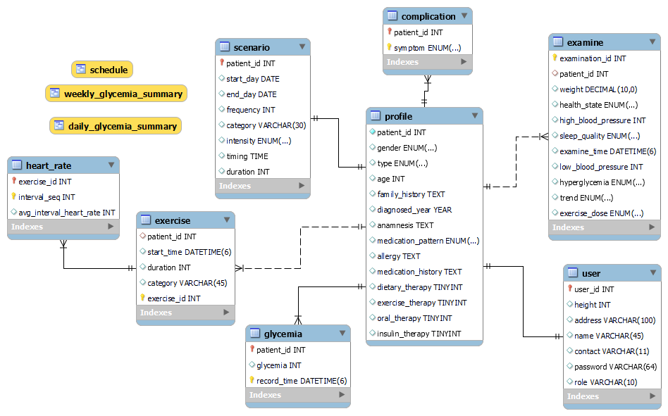

# Tangxiaozhi-Rehibilitation
本仓库是开发运动模块与患者管理模块的数据库设计

## ER图

## 数据库模式概述	

​	核心表是user，user的role可以是医生，患者，护士，管理员等等，现在有表doctor和profile，doctor表示医生相关的基本信息，working_hours表示医生的值班时间，profile表示患者的一些固定的和易表达的个人档案，比如既往病史，家族史，过敏史，并发症，身高，治疗方法，确诊年份，性别，地址，患糖尿病类型(I/II/妊娠)等等，complication表示并发症。examine表示定期检查后获得的一些身体指标，exercise表示患者进行的活动，heart_rate记录每个活动期间的每隔3分钟的平均心率。insulin表示胰岛素使用情况，treatment表示就诊情况，glycemia表示定期的血糖检测情况。

